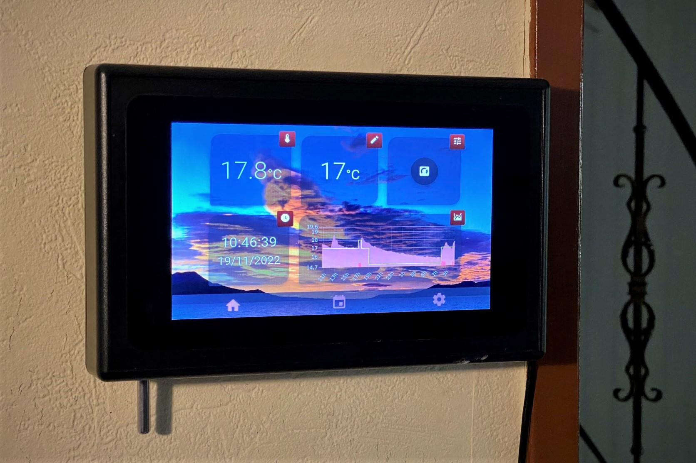

# DomoFox

An home thermostat project, intended to run into Raspberry pi with a 7" screen.
It is designed to work with a relay switch connected to the Raspberry pi GPIO.

Connect your home heater to this switch, connect a temperature sensor (see below) and, voila, you have a Domofox thermostat!

*Although it is actually working, please note this project is still under developement. You may experience bugs and/or unpolished design/features. If you consider contributing, please read the corresponding chapter below.*

# Overview

## Working modes

Domofox has 3 modes:
 * **OFF mode**: 
    
    switch the heater off

 * **MANUAL mode**:
    
    Regulate according the 'manual' setpoint defined and the ambiant temperature

 * **AUTOMATIC mode**: 
 
    Same as manual mode, except the setpoint will be updated according the planning you defined. Note that in this mode, you can stil change the setpoint manually between two plannified changes.

## Customized ambiant temperature

The ambiant temperature used to regulate is computed as a weighted average of your sensors value. Thus you can adapt sensors influence into the regulation.

Providing you use an existing driver code, or develop your own, you can use any kind of sensor.

## Default temperature sensor case

Domofox is by default designed to work with a **DS18B20 temperature probe** working with a 1-Wire connexion to the Raspberry pi GPIO.

# Architecture

## Client

Currently VueJs2 with Vuetify

## API

This is the core engine of Domofox temperature regulation. NodeJs powered with ExpressJs.
See [the full API specifications](./docs/openAPI.yml)

# Installation

All the details are mentionned in the [installation.md](installation.md) help file.

# Contributing
This project is currently developped alone on my (small) free time, but you may post a merge request so we can discuss about it.

# License
GNU General Public License v3.0

